# Campus-parcel-management

> **A containerized, microservice-based parcel management platform for campus environments - designed around independent services, REST APIs, service-to-service validation, local persistence, Docker orchestration, and measured performance under concurrent load.**


---

## Project Overview

The **Campus Parcel Management System** is a four-service microservice application that models a parcel workflow inside a university or campus environment.

Instead of implementing the complete system as one monolithic application, the platform separates responsibilities into four independently deployable services:

-  **Student Service** - manages student information.
-  **Parcel Service** - manages parcels and tracking information.
-  **Pickup Service** - manages pickup requests and coordinates validation across services.
-  **Storage Service** - manages parcel-storage locations and their availability.

The complete application is orchestrated using **Docker Compose**, allowing all four services to run together as a reproducible local deployment.

A key architectural feature is the **Pickup Service's inter-service communication**. When a pickup request is created, the Pickup Service verifies:

1. the requested parcel through the **Parcel Service**, and
2. the requested student through the **Student Service**,

before creating the pickup record.

This gives the project a genuine service-to-service workflow rather than four completely isolated APIs.

---

# Table of Contents

- [Project Overview](#project-overview)
- [System Highlights](#system-highlights)
- [Architecture](#architecture)
- [Service Responsibilities](#service-responsibilities)
- [Technology Stack](#technology-stack)
- [Service Ports](#service-ports)
- [Project Structure](#project-structure)
- [API Reference](#api-reference)
- [Inter-Service Communication](#inter-service-communication)
- [Data Management](#data-management)
- [Docker Deployment](#docker-deployment)
- [Running the Project](#running-the-project)
- [Functional Validation](#functional-validation)
- [Performance Testing](#performance-testing)
- [Performance Results](#performance-results)
- [Performance Graphs](#performance-graphs)
- [Evidence & Screenshots](#evidence--screenshots)
- [Design Decisions](#design-decisions)
- [Strengths](#strengths)
- [Current Limitations](#current-limitations)
- [Future Improvements](#future-improvements)
- [Conclusion](#-conclusion)

---

# System Highlights

| Capability | Implementation |
|---|---|
| Microservice architecture | 4 independent services |
| Container orchestration | Docker Compose |
| REST APIs | Flask + FastAPI |
| Student management | Full CRUD |
| Parcel management | Full CRUD |
| Pickup management | Create, read, complete |
| Service validation | Pickup -> Parcel + Student |
| Storage management | Create, list, assign, release |
| Persistence | SQLite for Student, Parcel and Pickup services |
| Storage state | In-memory for Storage Service |
| Load testing | Custom Python concurrent test harness |
| Resource monitoring | Docker CPU + memory sampling |
| Evidence | Functional screenshots + performance graphs |

---

# Architecture

The system follows a lightweight microservice architecture in which each service owns a specific business responsibility.

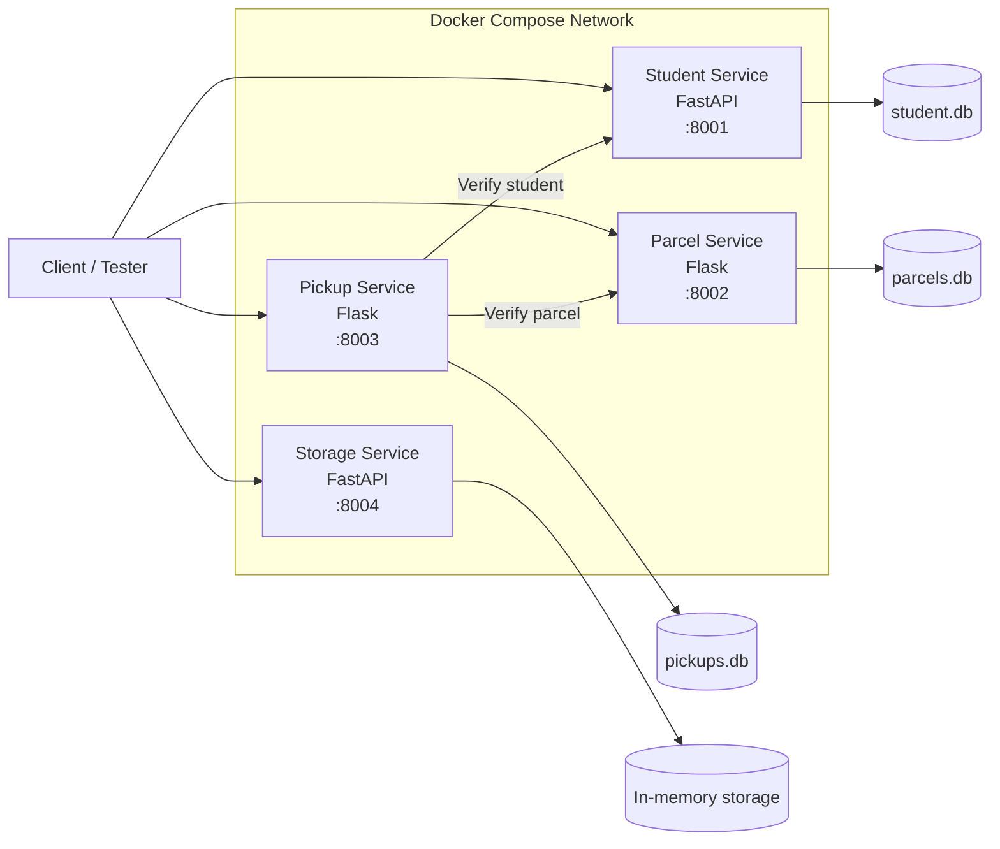

### Core Pickup Workflow

The most important cross-service workflow is:

```text
Client
  |
  | POST /pickup
  v
Pickup Service
  |
  |--> Parcel Service
  |       \-- GET /parcels/{parcel_id}
  |
  |--> Student Service
  |       \-- GET /students/{student_id}
  |
  v
SQLite pickups.db
  |
  \--> Pickup created with status = PENDING
```

This validation sequence demonstrates how one microservice can depend on authoritative information exposed by other services without directly accessing their databases.

---

# Service Responsibilities

## Student Service

**Framework:** FastAPI  
**Database:** SQLite (`student.db`)  
**Container Port:** `8000`  
**Host Port:** `8001`

### Responsibilities

- Create students
- Retrieve all students
- Retrieve a specific student
- Update student information
- Delete students

### Endpoints

| Method | Endpoint | Purpose |
|---|---|---|
| `GET` | `/` | Service health/status |
| `POST` | `/students` | Create a student |
| `GET` | `/students` | List all students |
| `GET` | `/students/{student_id}` | Retrieve one student |
| `PUT` | `/students/{student_id}` | Update a student |
| `DELETE` | `/students/{student_id}` | Delete a student |

---

## Parcel Service

**Framework:** Flask  
**Database:** SQLite (`parcels.db`)  
**Container Port:** `8000`  
**Host Port:** `8002`

### Responsibilities

- Register parcels
- Store courier and tracking information
- Track parcel status
- Retrieve parcels
- Update parcels
- Delete parcels

### Endpoints

| Method | Endpoint | Purpose |
|---|---|---|
| `GET` | `/` | Service health/status |
| `POST` | `/parcels` | Create a parcel |
| `GET` | `/parcels` | List parcels |
| `GET` | `/parcels/{parcel_id}` | Retrieve one parcel |
| `PUT` | `/parcels/{parcel_id}` | Update a parcel |
| `DELETE` | `/parcels/{parcel_id}` | Delete a parcel |

The parcel service also enforces a unique `tracking_id`.

---

## Pickup Service

**Framework:** Flask  
**Database:** SQLite (`pickups.db`)  
**Container Port:** `8000`  
**Host Port:** `8003`

### Responsibilities

- Create pickup requests
- Verify parcel existence
- Verify student existence
- Retrieve pickup records
- Complete pickups

### Endpoints

| Method | Endpoint | Purpose |
|---|---|---|
| `GET` | `/` | Service health/status |
| `POST` | `/pickup` | Create a pickup request |
| `GET` | `/pickup` | List pickup requests |
| `GET` | `/pickup/{pickup_id}` | Retrieve one pickup |
| `PUT` | `/pickup/{pickup_id}/complete` | Mark pickup as completed |

### Pickup State

A newly created pickup starts with:

```text
PENDING
```

and can later transition to:

```text
COMPLETED
```

---

## Storage Service

**Framework:** FastAPI  
**Storage model:** In-memory Python list  
**Container Port:** `8000`  
**Host Port:** `8004`

### Responsibilities

- Create storage locations
- List storage locations
- Find available storage
- Assign storage
- Release storage

### Endpoints

| Method | Endpoint | Purpose |
|---|---|---|
| `GET` | `/` | Service health/status |
| `POST` | `/storage` | Create storage |
| `GET` | `/storage` | List storage |
| `GET` | `/storage/available` | List available storage |
| `POST` | `/storage/assign` | Assign storage |
| `POST` | `/storage/release` | Release storage |

### Initial Storage

The service starts with:

```text
A-01 -> AVAILABLE
A-02 -> AVAILABLE
B-01 -> AVAILABLE
```

> **Note:** Storage Service state is currently held in memory, so it resets when the service/container restarts.

---

# Technology Stack

| Layer | Technology |
|---|---|
| Language | Python |
| Student API | FastAPI |
| Parcel API | Flask |
| Pickup API | Flask |
| Storage API | FastAPI |
| Validation | Pydantic / request validation |
| Databases | SQLite |
| Containerization | Docker |
| Orchestration | Docker Compose |
| Load testing | Python `concurrent.futures` |
| HTTP client | Python `urllib.request` |
| Source control | Git |
| Repository hosting | GitHub |

---

# Service Ports

| Service | Internal Port | Host Port | Base URL |
|---|---:|---:|---|
| Student Service | `8000` | `8001` | `http://localhost:8001` |
| Parcel Service | `8000` | `8002` | `http://localhost:8002` |
| Pickup Service | `8000` | `8003` | `http://localhost:8003` |
| Storage Service | `8000` | `8004` | `http://localhost:8004` |

Inside the Docker Compose network, services communicate using service names such as:

```text
http://parcel-service:8000
http://student-service:8000
```

This avoids using host-local addresses for container-to-container communication.

---

# Project Structure

```text
Campus-parcel-management/
|
|-- docker-compose.yml
|-- load_test.py
|-- README.md
|
|-- student-service/
|   |-- Dockerfile
|   |-- README.md
|   |-- app.py
|   \-- requirements.txt
|
|-- parcel-service/
|   |-- Dockerfile
|   |-- README.md
|   |-- app.py
|   \-- requirements.txt
|
|-- pickup-service/
|   |-- Dockerfile
|   |-- README.md
|   |-- app.py
|   \-- requirements.txt
|
|-- storage-service/
|   |-- Dockerfile
|   |-- README.md
|   |-- app.py
|   \-- requirements.txt
|
|-- GRAPHS/
|   |-- 01_response_time_vs_concurrency.png
|   |-- 02_throughput_vs_concurrency.png
|   |-- 03_total_requests.png
|   |-- 04_peak_cpu_usage.png
|   |-- 05_peak_memory_usage.png
|   \-- 06_failed_requests.png
|
\-- SCREENSHOTS/
    |-- functional/API evidence
    |-- Docker evidence
    |-- load-test evidence
    \-- Git/GitHub evidence
```

---

# API Reference

## Student Service - `8001`

### Create Student

```http
POST /students
Content-Type: application/json
```

Example:

```json
{
  "name": "Test Student",
  "email": "test123@example.com",
  "department": "CSE",
  "year": 3
}
```

---

## Parcel Service - `8002`

### Create Parcel

```http
POST /parcels
Content-Type: application/json
```

Example:

```json
{
  "student_id": 1,
  "courier": "DHL",
  "tracking_id": "TEST123",
  "status": "ARRIVED"
}
```

---

## Pickup Service - `8003`

### Create Pickup

```http
POST /pickup
Content-Type: application/json
```

Example:

```json
{
  "parcel_id": 1,
  "student_id": 1
}
```

The request is accepted only after the Pickup Service successfully verifies both referenced resources.

---

# Inter-Service Communication

The Pickup Service is the integration point between the Student and Parcel services.

When:

```http
POST /pickup
```

is received, the service performs:

```text
1. Validate request JSON
        v
2. Verify parcel
   GET http://parcel-service:8000/parcels/{parcel_id}
        v
3. Verify student
   GET http://student-service:8000/students/{student_id}
        v
4. Insert pickup record into pickups.db
        v
5. Return HTTP 201
```

This design provides a useful separation of responsibilities:

- **Student Service** owns student data.
- **Parcel Service** owns parcel data.
- **Pickup Service** owns pickup data.
- Pickup logic consumes APIs rather than directly reading another service's database.

### Evidence

The repository includes a dedicated screenshot showing the inter-service implementation:

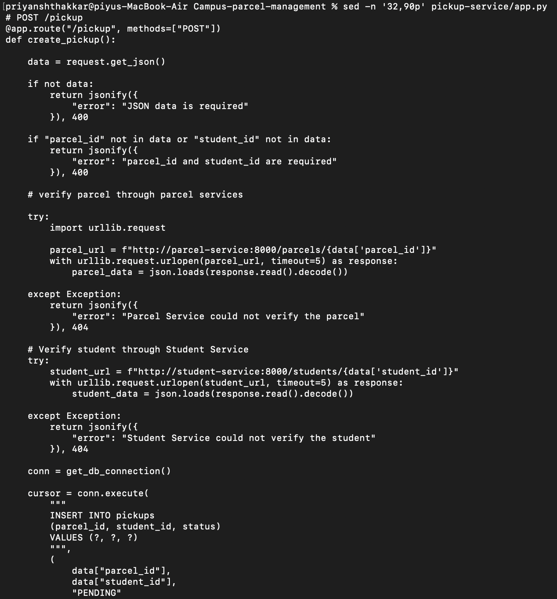

---

# Docker Deployment

The project is orchestrated through `docker-compose.yml`.

The Compose configuration builds four independent images:

```yaml
student-service:
  build: ./student-service

parcel-service:
  build: ./parcel-service

pickup-service:
  build: ./pickup-service

storage-service:
  build: ./storage-service
```

Each service runs on port `8000` inside its container while being exposed through a unique host port.

### Build all images

```bash
docker compose build
```

### Start the complete system

```bash
docker compose up
```

### Start in detached mode

```bash
docker compose up -d
```

### Check running containers

```bash
docker compose ps
```

### Stop the system

```bash
docker compose down
```

### View logs

```bash
docker compose logs
```

For one service:

```bash
docker compose logs pickup-service
```

---

# Running the Project

## Prerequisites

Install:

- Docker Desktop
- Git
- Python 3.x

Verify Docker:

```bash
docker --version
docker compose version
```

Verify Python:

```bash
python3 --version
```

---

## 1. Clone the repository

```bash
git clone https://github.com/01fe23bci004/Campus-parcel-management.git
cd Campus-parcel-management
```

## 2. Build the services

```bash
docker compose build
```

## 3. Start the services

```bash
docker compose up
```

## 4. Verify service health

Open:

```text
http://localhost:8001
http://localhost:8002
http://localhost:8003
http://localhost:8004
```

Each service exposes a root endpoint returning its service identity and running status.

---

# Functional Validation

The integrated workflow was manually validated using real HTTP requests.

A test student was created first.

Then a parcel referencing that student was created.

Finally, a pickup request referencing both the parcel and student was submitted.

The successful pickup creation demonstrated that:

```text
Student exists
      +
Parcel exists
      v
Pickup request accepted
      v
Pickup record created
```

### Example Successful Flow

```text
Student Service
    |
    | student_id = 1
    v
Parcel Service
    |
    | parcel_id = 1
    v
Pickup Service
    |
    v
HTTP 201 Created
status = PENDING
```

### Evidence

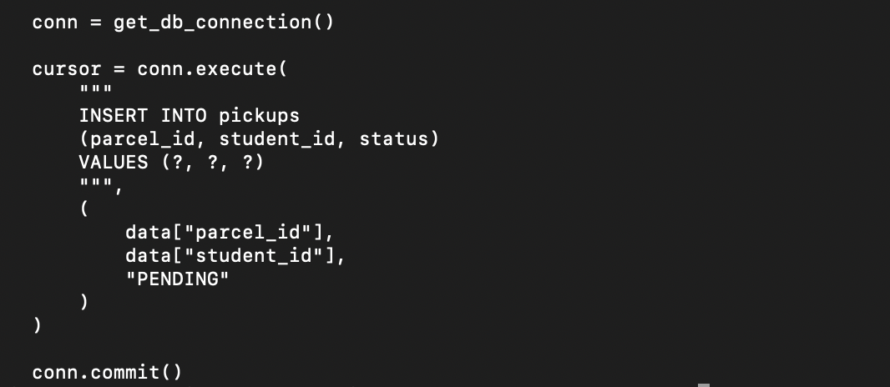

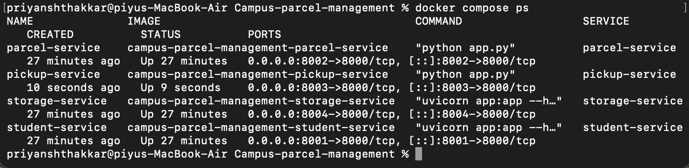

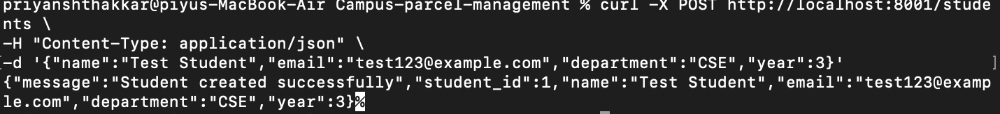

---

# Performance Testing

The project includes a custom Python load-testing program:

```text
load_test.py
```

The test targets:

```text
POST http://localhost:8003/pickup
```

Each generated request uses:

```json
{
  "parcel_id": 1,
  "student_id": 1
}
```

Because the Pickup endpoint performs downstream validation, the benchmark exercises not only the Pickup Service but also its communication with the Parcel and Student services.

---

## Test Methodology

Each workload was executed for approximately **10 seconds**.

The test varied the number of concurrent workers:

| Workload | Concurrency |
|---|---:|
| W1 | 1 |
| W2 | 2 |
| W3 | 4 |
| W4 | 8 |
| W5 | 16 |

For each workload, the test collected:

- Total requests
- Successful requests
- Failed requests
- Average response time
- Throughput
- Peak Docker CPU usage
- Peak Docker memory usage

Docker resource usage was sampled while the workload was running using:

```text
docker stats --no-stream
```

---

# Performance Results

The measured results were:

| Workload | Concurrency | Avg. Response Time | Throughput | Failed |
|---|---:|---:|---:|---:|
| W1 | 1 | 2.9 ms | 313.84 req/s | 0 |
| W2 | 2 | 4.6 ms | **356.59 req/s** | 0 |
| W3 | 4 | 8.5 ms | 305.38 req/s | 0 |
| W4 | 8 | 14.0 ms | 306.23 req/s | 0 |
| W5 | 16 | 28.5 ms | 234.30 req/s | 0 |

### Key observations

- **0 failed requests** were recorded across all five workloads.
- The highest measured throughput was **356.59 requests/second at concurrency 2**.
- Average response time increased as concurrency increased.
- At concurrency 16, average response time reached **28.5 ms**.
- Throughput remained around the 300 req/s range through W4 before dropping to **234.30 req/s** at W5.
- The results indicate that the tested deployment handled the measured workload successfully, while higher concurrency introduced increasing latency and reduced throughput.

> Performance numbers are environment-dependent and should be interpreted as measurements from the tested local Docker environment rather than universal capacity limits.

---

# Performance Graphs

## 1. Average Response Time vs Concurrency

This graph shows how request latency changed as concurrency increased.

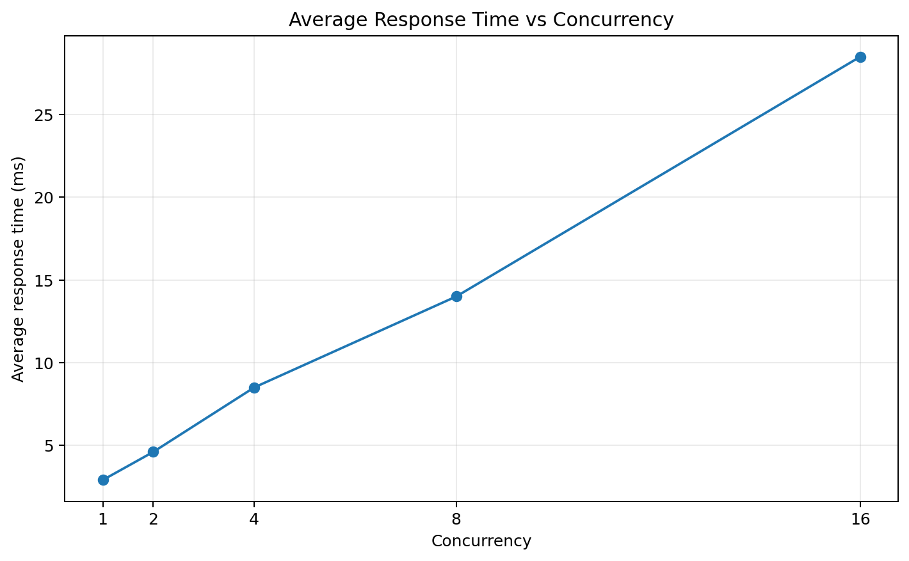

**Interpretation:** response time increased from approximately **2.9 ms at concurrency 1** to **28.5 ms at concurrency 16**.

---

## 2. Throughput vs Concurrency

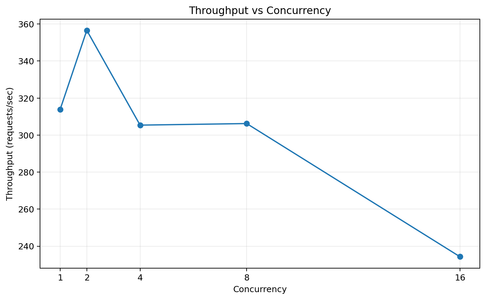

**Interpretation:** throughput peaked at **356.59 req/s** under the W2 workload and later declined at the highest tested concurrency.

---

## 3. Total Requests by Workload

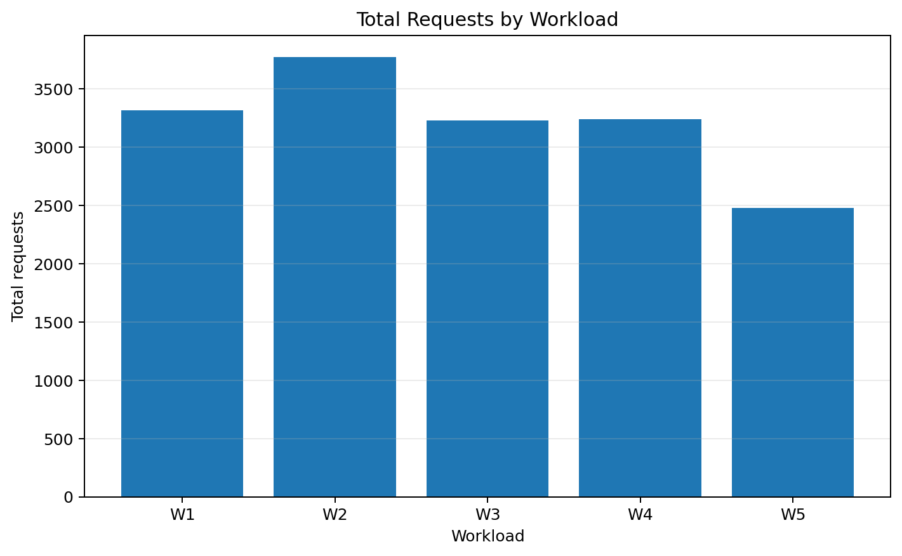

The number of completed requests reflects both the workload duration and the system's ability to sustain the selected concurrency level.

---

## 4. Peak CPU Usage

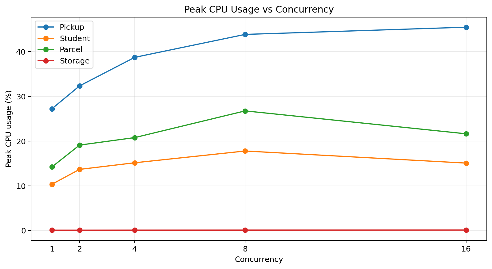

The CPU graph compares peak Docker CPU utilization across:

- Pickup Service
- Student Service
- Parcel Service
- Storage Service

The Pickup Service shows the highest CPU utilization among the monitored services during the tested workloads, which is consistent with its role as the request-processing and orchestration point.

---

## 5. Peak Memory Usage

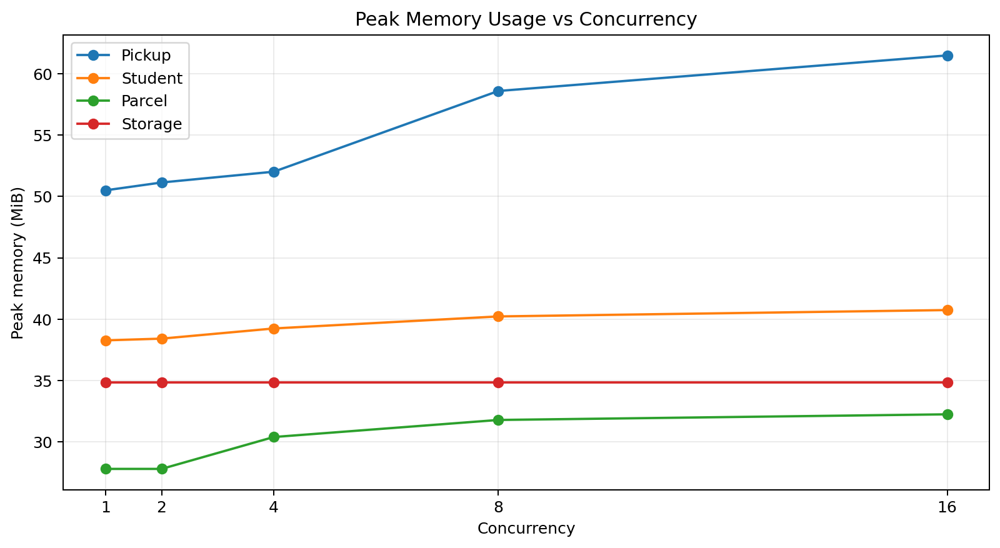

Memory usage remained relatively stable across the workloads, with the Pickup Service reaching approximately **61.50 MiB** at W5.

---

## 6. Failed Requests

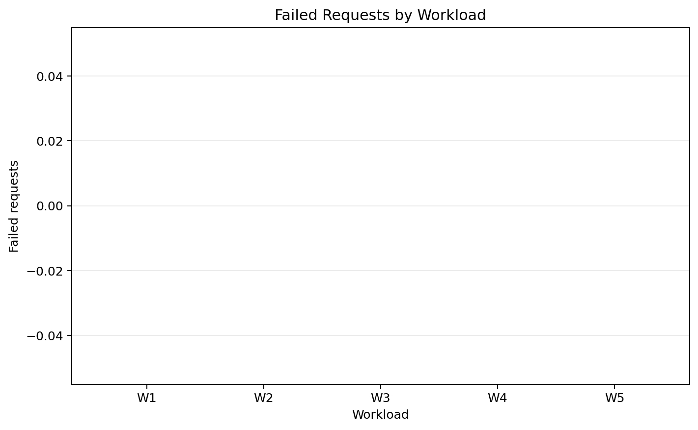

All five workloads recorded:

```text
0 failed requests
```

This is an important reliability result for the tested workload range.

---

# Evidence & Screenshots

The repository contains a dedicated `SCREENSHOTS/` directory with evidence covering the major implementation stages.

Rather than flooding the README with every screenshot, the most important evidence is highlighted below.

---

## Containerized Deployment

The Docker Compose status confirms that the four services can run together as containers.


---

## Service Health

The root endpoint verification demonstrates that the deployed services respond successfully.


---

## Service-to-Service Validation

The Pickup Service implementation demonstrates HTTP communication with the Parcel and Student services.


---

## Successful Pickup Creation

The integrated pickup workflow was validated using a real request.


---

## Highest-Concurrency Test

The W5 evidence documents the test executed with:

```text
Concurrency = 16
```

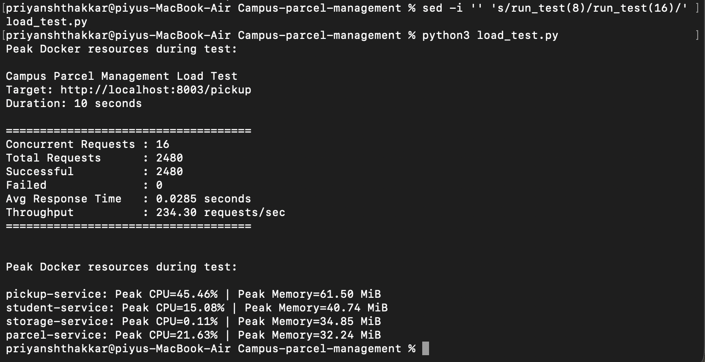

---

## GitHub Integration

The project was committed and successfully pushed to the GitHub repository.

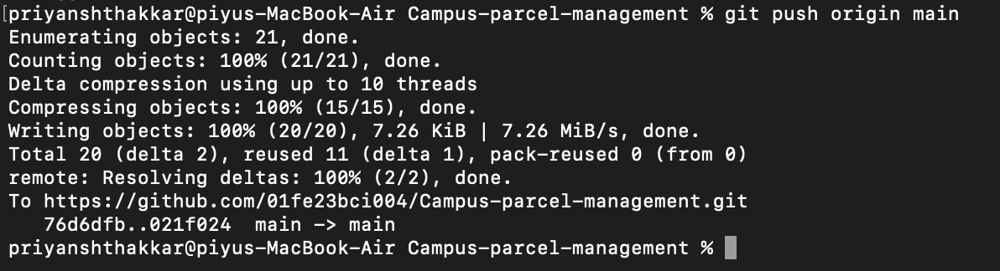

---

# Design Decisions

## 1. Independent service ownership

Each service owns a specific business domain instead of sharing application logic.

This makes the architecture easier to understand, test and evolve.

---

## 2. API-based service communication

Pickup validation uses HTTP calls to other services:

```text
Pickup -> Parcel
Pickup -> Student
```

This keeps service boundaries explicit.

---

## 3. Docker-based reproducibility

Docker Compose provides a single orchestration layer for the complete application.

Instead of manually starting four different applications, the complete system can be started using:

```bash
docker compose up
```

---

## 4. Lightweight persistence

SQLite provides simple local persistence for the Student, Parcel and Pickup services without introducing an additional database server.

This keeps the academic project lightweight while still demonstrating database-backed microservices.

---

## 5. Dedicated performance harness

The custom load tester was intentionally kept inside the repository so that the performance experiment is reproducible and inspectable.

The script measures both application-level performance and container-level resource usage.

---

# Strengths

### Clear service boundaries

The four domains have separate implementations and separate containers.

### Real inter-service communication

Pickup requests perform downstream verification instead of blindly accepting foreign IDs.

### Containerized deployment

The entire application can be built and launched through Docker Compose.

### RESTful APIs

The services expose clear HTTP endpoints using standard CRUD-style operations.

### Measured performance

The project includes a repeatable concurrency experiment rather than relying only on qualitative claims.

### Resource monitoring

CPU and memory usage were monitored alongside request performance.

### Evidence-driven implementation

The repository contains implementation, Docker, functional testing, load-testing and Git/GitHub evidence.

---

# Current Limitations

The project is intentionally lightweight and has several areas that could be improved for production use.

### Storage persistence

The Storage Service currently stores its data in memory:

```python
storage_data = [...]
```

A service restart therefore resets its state.

### Authentication

The current APIs do not implement user authentication or authorization.

### Distributed reliability

There is no retry policy, circuit breaker, message queue or service discovery mechanism beyond Docker Compose networking.

### Observability

The current monitoring is based primarily on Docker statistics and application-level timing. A production deployment would benefit from centralized logging and metrics.

### Scalability

The measured performance results represent the tested local environment. They should not be interpreted as a formal production capacity benchmark.

---

# Future Improvements

A production-oriented version could introduce:

-  JWT authentication and role-based access control
-  PostgreSQL or another production database
-  Persistent storage for the Storage Service
-  Retry and timeout policies
-  Circuit breakers
-  Asynchronous messaging with RabbitMQ/Kafka
-  Prometheus + Grafana observability
-  Structured centralized logging
-  Automated unit and integration tests
-  CI/CD with GitHub Actions
-  Kubernetes deployment
-  Distributed tracing with OpenTelemetry
-  Secrets management
-  Automated performance regression testing

---

# Reproducing the Performance Test

Start the complete system:

```bash
docker compose up
```

Then run:

```bash
python3 load_test.py
```

The current script is configured to execute the final test using:

```python
run_test(16)
```

For the complete W1-W5 experiment, the concurrency value can be changed to:

```text
1
2
4
8
16
```

and each run can be recorded using the same methodology.

---

# Evidence Repository

The repository deliberately separates visual evidence from application source code:

```text
GRAPHS/
    |-- performance graphs

SCREENSHOTS/
    |-- service implementation
    |-- API testing
    |-- Docker deployment
    |-- load testing
    \-- Git/GitHub workflow
```

This makes the project easier to evaluate without mixing implementation files and evidence artifacts.

---

# Conclusion

The **Campus Parcel Management System** demonstrates a complete, containerized microservice workflow for managing students, parcels, pickups and storage within a campus environment.

The project goes beyond simply creating four APIs by demonstrating:

```text
Independent Services
        v
Docker Containerization
        v
REST APIs
        v
Inter-Service Communication
        v
Database-Backed Operations
        v
Functional Validation
        v
Concurrent Load Testing
        v
CPU & Memory Monitoring
        v
Performance Analysis
```

The measured experiment successfully completed all tested workloads without failed requests. The strongest measured throughput was **356.59 requests/second**, while average response time increased from **2.9 ms** at concurrency 1 to **28.5 ms** at concurrency 16.

Overall, the project provides a compact but complete demonstration of **microservice decomposition, container orchestration, API integration, persistence, testing and performance evaluation** in a campus parcel-management scenario.

---

## Repository Evidence

The repository includes:

- `docker-compose.yml` - multi-service orchestration
- `load_test.py` - concurrent performance test harness
- `student-service/` - student management microservice
- `parcel-service/` - parcel management microservice
- `pickup-service/` - pickup and service-integration microservice
- `storage-service/` - storage management microservice
- `GRAPHS/` - performance visualizations
- `SCREENSHOTS/` - implementation and testing evidence

---

<p align="center">
  <strong> Campus Parcel Management System</strong><br>
  <sub>Microservices - REST APIs - Docker - SQLite - Performance Engineering</sub>
</p>
